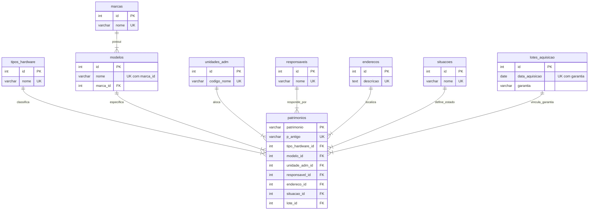

### 📁 Organização e Estrutura do Django
1. O Django foi organizado em uma estrutura limpa e escalável, conforme abaixo:

ESTRUTURA DO DJANGO
```text
ProjetoPatrimonio/
│
├── sistema_producao/
│   │
│   ├── sistema_institucional/        # Configurações centrais do Django
│   │   ├── settings.py               # Configuração de acesso ao BD, no bloco DATABASES / Configuração de Envio de E-mail (Gmail)
│   │   └── urls.py
│   │
│   ├── patrimonio/                   # App principal do sistema e PASTA CHAVE: Onde fica a lógica do PDF
│   │   ├── migrations/
│   │   │
│   │   ├── templates/                   
│   │   │   └── patrimonio/                  # Telas em HTML   
│   │   │       ├── alterar_senha.html
│   │   │       ├── consulta.html
│   │   │       ├── login.html			     
│   │   │       ├── movimentacao_form.html   # Aqui fica o Fetch API
│   │   │       └── upload.html
│   │   │
│   │   ├── static/                   # Arquivos estáticos do Frontend
│   │   │   └── js/
│   │   │       └── jquery.min
│   │   │           
│   │   ├── admin.py
│   │   ├── apps.py
│   │   ├── email_backend.py
│   │   ├── forms.py
│   │   ├── middleware.py
│   │   ├── models.py                 # Tabelas
│   │   ├── signals.py                  
│   │   ├── utils.py                  
│   │   └── views.py                  # Telas de consulta e lógica de movimentação, e Script Python puro que lê o PDF e extrai dados
│   │
│   ├── manage.py                     # Utilitário de linha de comando do Django para tarefas administrativas / "... def main(): ... os.environ.setdefault('DJANGO_SETTINGS_MODULE', 'sistema_institucional.settings') ..."
│   ├── .env.example                  # Modelo de configuração do Postgres
│   ├── requirements.txt              # Bibliotecas do projeto
│   └── README.md                     # O tutorial em si
│
└── ambdj/            # Ambiente do Django
```


### 📊 Esquema Relacional do Banco de Dados (PostgreSQL)
2. O banco de dados está normalizado e numa boa estruturado, com tabelas de suporte para marcas, modelos, localizações e lotes, deixando a tabela principal (patrimonios) limpa e eficiente.

2.1. Código Mermaid.js
Aqui está o código completo em Mermaid.js baseado exatamente no script SQL, constante no arquivo README.md do GitHub.
O diagrama abaixo ilustra a arquitetura normalizada do banco de dados. A tabela central `patrimonios` conecta-se a todas as tabelas especialistas através de chaves estrangeiras (`FK`).



🔍 O que esse diagrama explica:
1) Relacionamento de Modelos: Uma marca pode ter 1 ou muitos modelos, mas um modelo pertence obrigatoriamente a uma marca.
2) Centralização de Dados: A tabela patrimonios exige obrigatoriamente (||--|{) que cada item cadastrado aponte para um registro válido em cada uma das tabelas de suporte (não aceitando campos nulos, exatamente como os seus NOT REFERENCES ... NOT NULL do SQL).
3) Chaves Primárias Naturais: Mostra que o campo patrimonio (número patrimonial) é a própria Chave Primária (PK) de texto (character varying (50) ou varchar (50)), eliminando a necessidade de um ID sequencial numérico para essa tabela específica.


### 📄 Processamento de PDF com pdfplumber
3. Como o sistema não possui cadastro manual de bens, o fluxo de dados começa obrigatoriamente pelo upload do relatório PDF institucional. O arquivo é processado em memória, os dados são extraídos e, em seguida, salvos no banco de dados.

3.1. O Modelo de Dados (models.py) 
Suporta as funcionalidades do sistema que contém: o upload de relatório PDF institucional, extraindo e salvando os dados no banco de dados; o estado atual do hardware; e o histórico de movimentações. O sistema utiliza modelos. Há o modelo principal que está conectado aos outros, relacionados a aquele, por uma chave estrangeira (ForeignKey):

PYTHON
```text
from django.db import models
from django.contrib.auth.models import User

class RegistroAcesso(models.Model):
    # Opções para o tipo de ação
    TIPOS_ACAO = [
        ('LOGIN', 'Login com Sucesso'),
        ('LOGOUT', 'Logout (Saída)'),
        ('COLETA', 'Executou Coleta PDF ASI'),
        ('CONSULTA', 'Realizou Consulta Rápida'),
        ('RELATÓRIO', 'Gerou Relatório'),
        ('BLOQUEIO', 'Tentativa de Acesso Direto (Página Protegida)'),
    ]

    usuario = models.ForeignKey(User, on_delete=models.CASCADE, verbose_name="Usuário")
    data_acesso = models.DateTimeField(auto_now_add=True, verbose_name="Data/Hora")
    ip_usuario = models.GenericIPAddressField(null=True, blank=True, verbose_name="Endereço IP")
    # Novos campos customizados
    acao = models.CharField(max_length=10, choices=TIPOS_ACAO, default='LOGIN', verbose_name="Ação")
    pagina_acessada = models.CharField(max_length=255, null=True, blank=True, verbose_name="Página/URL")

    class Meta:
        ordering = ['-data_acesso']
        verbose_name = "Registro de Acesso"
        verbose_name_plural = "Registros de Acesso"

    def __str__(self):
        return f"{self.usuario.username} - {self.get_acao_display()} ({self.data_acesso.strftime('%d/%m/%Y %H:%M')})"

# ==============================================================================
# 1. TABELAS INDEPENDENTES (AUXILIARES)
# ==============================================================================

class TipoHardware(models.Model):
    nome = models.CharField(max_length=100, unique=True)

    class Meta:
        db_table = 'tipos_hardware'

    def __str__(self):
        return self.nome


class Marca(models.Model):
    nome = models.CharField(max_length=100, unique=True)

    class Meta:
        db_table = 'marcas'

    def __str__(self):
        return self.nome


class UnidadeAdm(models.Model):
    codigo_nome = models.CharField(max_length=255, unique=True)

    class Meta:
        db_table = 'unidades_adm'

    def __str__(self):
        return self.codigo_nome


class Responsavel(models.Model):
    nome = models.CharField(max_length=150, unique=True)

    class Meta:
        db_table = 'responsaveis'

    def __str__(self):
        return self.nome


class Endereco(models.Model):
    descricao = models.TextField(unique=True)

    class Meta:
        db_table = 'enderecos'

    def __str__(self):
        return self.descricao[:50]  # Retorna apenas o começo para não quebrar o admin


class Situacao(models.Model):
    nome = models.CharField(max_length=50, unique=True)

    class Meta:
        db_table = 'situacoes'

    def __str__(self):
        return self.nome


class LoteAquisicao(models.Model):
    data_aquisicao = models.DateField()
    garantia = models.CharField(max_length=100)

    class Meta:
        db_table = 'lotes_aquisicao'
        # Replica a regra SQL: UNIQUE(data_aquisicao, garantia)
        unique_together = ('data_aquisicao', 'garantia')

    def __str__(self):
        return f"Lote {self.data_aquisicao} (Garantia: {self.garantia})"


# ==============================================================================
# 2. TABELAS DEPENDENTES
# ==============================================================================

class Modelo(models.Model):
    nome = models.CharField(max_length=100)
    # Aponta para a classe 'Marca' definida acima
    marca = models.ForeignKey(Marca, on_delete=models.PROTECT, related_name='modelos')

    class Meta:
        db_table = 'modelos'
        # Replica a regra SQL: UNIQUE(nome, marca_id)
        unique_together = ('nome', 'marca')

    def __str__(self):
        return f"{self.marca.nome} {self.nome}"


# ==============================================================================
# 3. TABELA PRINCIPAL
# ==============================================================================

class Patrimonio(models.Model):
    # Chave primária natural de texto (VARCHAR(50) PRIMARY KEY)
    patrimonio = models.CharField(max_length=50, primary_key=True)
    p_antigo = models.CharField(max_length=50, unique=True, null=True, blank=True)
    
    # Mapeamento exato de todas as chaves estrangeiras (FOREIGN KEYS) do seu SQL
    # db_column força o Django a usar o nome exato da coluna do seu banco original
    tipo_hardware = models.ForeignKey(TipoHardware, on_delete=models.PROTECT, db_column='tipo_hardware_id')
    modelo = models.ForeignKey(Modelo, on_delete=models.PROTECT, db_column='modelo_id')
    unidade_adm = models.ForeignKey(UnidadeAdm, on_delete=models.PROTECT, db_column='unidade_adm_id')
    responsavel = models.ForeignKey(Responsavel, on_delete=models.PROTECT, db_column='responsavel_id')
    endereco = models.ForeignKey(Endereco, on_delete=models.PROTECT, db_column='endereco_id')
    situacao = models.ForeignKey(Situacao, on_delete=models.PROTECT, db_column='situacao_id')
    lote = models.ForeignKey(LoteAquisicao, on_delete=models.PROTECT, db_column='lote_id')

    class Meta:
        db_table = 'patrimonios'

    def __str__(self):
        return f"Patrimônio {self.patrimonio} - {self.tipo_hardware.nome}"
```

3.2. O Serviço de Extração na View de Upload (em: views.py)
Há função responsável por varrer o PDF. O pdfplumber abre o documento e lê o texto linha por linha. É necessário adaptar os termos PATRIMÔNIO:, PAT_ANTIGO:, TIPO: etc., de acordo com a estrutura exata do relatório da instituição. 
No Django, quando o formulário HTML é enviado, o arquivo fica disponível em request.FILES. Esse arquivo é passado diretamente para o views.py (na função responsável por varrer o PDF) sem precisar salvá-lo no disco do servidor:

PHYTON
```text
# (IMPORTAR RELATÓRIO DO ASI EM PDF RELACIONADO A PATRIMÔNIOS DE EQUIPAMENTOS DE TIC DA PRMA, PRM'S BACABAL-MA, CAXIAS-MA E IMPERATRIZ-MA, E ERM/BALSAS-MA)
def converter_data(data_str):
    """Converte datas do formato DD/MM/AAAA para AAAA-MM-DD para o Postgres"""
    if not data_str or data_str.strip() == "":
        return None
    try:
        data_limpa = data_str.strip()
        # Se já estiver no formato AAAA-MM-DD, apenas retorna
        if re.match(r'^\d{4}-\d{2}-\d{2}$', data_limpa):
            return data_limpa
        # Se estiver no formato DD/MM/AAAA, converte
        return datetime.strptime(data_limpa, "%d/%m/%f").strftime("%Y-%m-%d")
    except ValueError:
        # Caso a conversão falhe, retorna a data de hoje ou uma data padrão para não quebrar o banco
        return datetime.today().strftime("%Y-%m-%d")

def executar_exclusao_por_tipo(nome_tipo_hardware, contagem_insercao):
    """
    Busca o ID do tipo de hardware e deleta os patrimônios correspondentes.
    Esta função deve ser chamada dentro de um bloco de transação ativa.
    """
    # Garante a padronização do texto (remove espaços e põe em maiúsculo)
    nome_tipo_hardware = nome_tipo_hardware.strip().upper()
    
    try:
        # Busca o tipo de hardware na base normalizada
        tipo_hardware = TipoHardware.objects.get(nome=nome_tipo_hardware)
    except TipoHardware.DoesNotExist:
        raise ValueError(f"O tipo '{nome_tipo_hardware}' não está cadastrado em tipos_hardware.")

    # 1. Faz a contagem eficiente no banco de dados
    quantidade_atual = Patrimonio.objects.filter(tipo_hardware_id=tipo_hardware.id).count()

    if contagem_insercao < quantidade_atual :
        # 2. Em seguida, executa a exclusão que você já tem
        # Executa o DELETE cirúrgico com o ID encontrado
        # O Django se encarrega de rodar isso no PostgreSQL de forma otimizada
        qtd_deletada, _ = Patrimonio.objects.filter(tipo_hardware_id=tipo_hardware.id).delete()
    
        #print(f"-> Sucesso: {qtd_deletada} registros antigos de '{nome_tipo_hardware}' foram excluídos.")
    
    # Retorna o ID caso a sua rotina de inserção precise dele para criar os novos registros
    return tipo_hardware.id

# A função responsável por varrer o PDF #
@login_required
def importar_pdf_patrimonio(request):     
    if request.method == 'POST' and request.FILES.get('arquivo_pdf'):
        pdf_enviado = request.FILES['arquivo_pdf']
        inventario1 = {}
        
        try:
            # Converte o arquivo enviado para um fluxo de bytes estático em memória
            pdf_bytes = io.BytesIO(pdf_enviado.read())
            
            nhard = "N/A"
            total_a_inserir = 0
            with pdfplumber.open(pdf_bytes) as pdf:
                for pagina in pdf.pages:
                    texto_completo = pagina.extract_text() or ""
                    
                    ua_atual = "NÃO ENCONTRADA"
                    resp_atual = "NÃO ENCONTRADO"
                    
                    # 1. CAPTURA DOS CABEÇALHOS
                    for linha in texto_completo.split('\n'):
                        if "Unidade Administrativa:" in linha:
                            ua_atual = linha.split("Unidade Administrativa:")[1].strip()
                        elif "Responsável:" in linha:
                            resp_atual = linha.split("Responsável:")[1].strip()
                    
                    # 2. ESTRATÉGIA PARA O ENDEREÇO
                    enderecos_posicionados = []
                    linhas_com_posicao = pagina.extract_text_lines() or []
                    for linha in linhas_com_posicao:
                        texto_linha = linha['text']
                        if "Endereço:" in texto_linha and not "Total" in texto_linha:
                            conteudo_endereco = texto_linha.split("Endereço:")[1].strip()
                            enderecos_posicionados.append({
                                "texto": conteudo_endereco,
                                "top": linha['top']
                            })
                    
                    enderecos_posicionados.sort(key=lambda x: x['top'])
                    
                    # 3. LEITURA DAS TABELAS
                    tabelas_detectadas = pagina.find_tables()
                    for tabela_objeto in tabelas_detectadas:
                        tabela_top = tabela_objeto.bbox[1]
                        tabela_dados = tabela_objeto.extract()
                        
                        end_atual = "NÃO ENCONTRADO"
                        for end in enderecos_posicionados:
                            if end['top'] < tabela_top:
                                end_atual = end['texto']
                                
                        for linha in tabela_dados:
                            if len(linha) >= 4 and linha[1]:
                                patrimonio_bruto = str(linha[1]).strip()
                                
                                if "total" in patrimonio_bruto.lower() or "," in patrimonio_bruto:
                                    continue
                                
                                patrimonio_limpo = "".join(re.findall(r'\d+', patrimonio_bruto))
                                if re.match(r'^\d{7,8}$', patrimonio_limpo):
                                    patrimonio = patrimonio_limpo
                                    p_antigo = linha[2].strip() if linha[2] else ""
                                    descricao = linha[3] if linha[3] else ""
                                    garantia = linha[4] if linha[4] else ""
                                    situacao = linha[5] if linha[5] else ""
                                    aquisicao = linha[7] if linha[7] else ""
                                    
                                    descricao_limpa = " ".join(descricao.split())
                                    
                                    # --- TRATAMENTO CORRIGIDO PARA DESKTOPS E NOTEBOOKS ---
                                    hardware_match = None
                                    #nhard = "N/A"
                                    descricao_maiuscula = descricao_limpa.upper()

                                    # 1. Testa primeiro o termo mais específico (Notebook)
                                    if "MICROCOMPUTADOR PORTATIL" in descricao_maiuscula:
                                        hardware_match = re.search(r'MICROCOMPUTADOR PORTATIL\s*:?\s*(.*?)(?=\s-|$)', descricao_limpa, re.IGNORECASE)
                                    # 2. Se não for notebook, testa se é o desktop ou outro equipamento padrão
                                    elif "MICROCOMPUTADOR" in descricao_maiuscula:
                                        hardware_match = re.search(r'MICROCOMPUTADOR\s*:?\s*(.*?)(?=\s-|$)', descricao_limpa, re.IGNORECASE)
                                    elif "MONITOR DE VIDEO" in descricao_maiuscula:
                                        hardware_match = re.search(r'MONITOR DE VIDEO\s*:?\s*(.*?)(?=\s-|$)', descricao_limpa, re.IGNORECASE)
                                    elif "APARELHO DE" in descricao_maiuscula:
                                        hardware_match = re.search(r'APARELHO DE\s*:?\s*(.*?)(?=\s-|$)', descricao_limpa, re.IGNORECASE)

                                    # 3. EXTRAÇÃO SEGURA: Valida se o Regex encontrou um objeto válido (e não uma String)
                                    if hardware_match and not isinstance(hardware_match, str):
                                        hardware = hardware_match.group(1).strip()
                                    else:
                                        # Fallback seguro caso a linha tenha o termo mas o Regex não capture o resto
                                        if "PORTATIL" in descricao_maiuscula or "NOTEBOOK" in descricao_maiuscula:
                                            hardware = "NOTEBOOK"
                                        elif "DESKTOP" in descricao_maiuscula:
                                            hardware = "DESKTOP"
                                        elif "LCD" in descricao_maiuscula:
                                            hardware = "LCD"
                                        elif "LED" in descricao_maiuscula:
                                            hardware = "LED"
                                        elif "TELEFONE IP" in descricao_maiuscula:
                                            hardware = "TELEFONE_IP"

                                    # Limpa resíduos de pontuação do PDF
                                    hardware = hardware.replace(';', '').strip()

                                    # Padroniza a variável final que vai para o banco de dados
                                    if hardware.upper() == "DESKTOP":
                                        nhard = "DESKTOP"
                                    elif hardware.upper() == "NOTEBOOK" or "PORTATIL" in hardware.lower():
                                        nhard = "NOTEBOOK"
                                    elif hardware.upper() == "LCD":
                                        nhard = "MONITOR_LCD"
                                    elif hardware.upper() == "LED":
                                        nhard = "MONITOR_LED"
                                    elif hardware.upper() == "TELEFONE IP" : 
                                        nhard = "TELEFONE_IP"
                                    # ------------------------------------------------------

                                    # Extração de Marca parando no " -" ou removendo pontuações residuais
                                    marca_match = re.search(r'MARCA\s*:?\s*(.*?)(?=\s-|$)', descricao_limpa, re.IGNORECASE)
                                    marca = marca_match.group(1).strip() if marca_match else "N/A"
                                    # TRATAMENTO CRÍTICO (Marca): Remove pontos e vírgulas residuais capturados do PDF
                                    marca = marca.replace(';', '').strip()
 
                                    # --- TRATAMENTO CORRIGIDO PARA MODELO (TODOS EM MAIÚSCULAS) ---
                                    descricao_maiuscula = descricao_limpa.upper()
                                    modelo = "N/A"

                                    # 1. TRATAMENTO PARA PORTÁTEIS (Notebooks)
                                    if "MICROCOMPUTADOR PORTATIL" in descricao_maiuscula:
                                        # Verificação das regras fixas usando os termos em maiúsculas
                                        if "DELL" in descricao_maiuscula and "MODELO 3490" in descricao_maiuscula:
                                            modelo = "LATITUDE 3490"
                                        elif "POSITIVO" in descricao_maiuscula and "MASTER N4340" in descricao_maiuscula:
                                            modelo = "MASTER N4340"
                                        elif "HP" in descricao_maiuscula and not "ELITEBOOK 640 G9" in descricao_maiuscula and not "ELITEBOOK 840 G3" in descricao_maiuscula:
                                            modelo = "ELITEBOOK 640 G9"
                                        else:
                                            modelo_match = re.search(r'MODELO\s*:?\s*(.*?)(?=\s-|$)', descricao_limpa, re.IGNORECASE)
                                            if modelo_match:
                                                modelo = modelo_match.group(1).strip()
                                    # 2. TRATAMENTO PARA DESKTOPS OU OUTROS EQUIPAMENTOS PADRÃO
                                    elif "MICROCOMPUTADOR" in descricao_maiuscula or "MONITOR DE VIDEO" in descricao_maiuscula:
                                        modelo_match = re.search(r'MODELO\s*:?\s*(.*?)(?=\s-|$)', descricao_limpa, re.IGNORECASE)
                                        if modelo_match:
                                            modelo = modelo_match.group(1).strip()

                                    # Limpeza final das pontuações
                                    modelo = modelo.replace(';', '').replace(',', '').strip()
                                    # -------------------------------------------------------

                                    garantia_limpa = " ".join(garantia.split())
                                    if not garantia_limpa == "" :
                                       gar_atual = garantia_limpa
                                    
                                    sit_atual = situacao_limpa = " ".join(situacao.split())

                                    aqui_atual = aquisicao_limpa = " ".join(aquisicao.split())
                                  
                                    # Alimentando o dicionário na memória
                                    if patrimonio not in inventario1:
                                        inventario1[patrimonio] = (p_antigo, nhard, marca, modelo, ua_atual, resp_atual, end_atual, gar_atual, sit_atual, aqui_atual)
                                    elif inventario1[patrimonio][3] == "N/A" and modelo != "N/A":
                                        inventario1[patrimonio] = (p_antigo, nhard, marca, modelo, ua_atual, resp_atual, end_atual, gar_atual, sit_atual, aqui_atual)

                                    total_a_inserir += 1

            # A sua variável que define dinamicamente o tipo de hardware atual
            variavel_tipo_atual = nhard  # Pode vir de um loop, de um arquivo, etc.

            # -----------------------------------------------------------------
            # PASSO 2: Chama a rotina de exclusão passando a variável
            # -----------------------------------------------------------------
            tipo_id_para_insercao = executar_exclusao_por_tipo(variavel_tipo_atual, total_a_inserir)

            # 3. SEGUNDA PARTE: PROCESSAR E SALVAR NO POSTGRESQL (TRANSAÇÃO ATÔMICA)
            total_inserido = 0
            with transaction.atomic():
                for pat, dados in inventario1.items():
                    # --- CORREÇÃO DA ORDEM DO DESEMPACOTAMENTO ---
                    p_ant, hard, mar, mod, ua, resp, end, gar, sit, aqui = dados
                    
                    # Converte a string de aquisição para formato aceito pelo banco
                    data_formatada = converter_data(aqui)
                    
                    # Cria ou busca os registros nas tabelas auxiliares garantindo o uso das variáveis corretas
                    tipo_obj, _ = TipoHardware.objects.get_or_create(nome=hard)
                    marca_obj, _ = Marca.objects.get_or_create(nome=mar)
                    modelo_obj, _ = Modelo.objects.get_or_create(nome=mod, marca=marca_obj)
                    
                    # Aqui o Django vai ler os nomes reais vindos do seu PDF mapeados em 'ua', 'resp' e 'end'
                    unidade_obj, _ = UnidadeAdm.objects.get_or_create(codigo_nome=ua)
                    resp_obj, _ = Responsavel.objects.get_or_create(nome=resp)
                    end_obj, _ = Endereco.objects.get_or_create(descricao=end)
                    
                    sit_obj, _ = Situacao.objects.get_or_create(nome=sit)
                    
                    lote_obj, _ = LoteAquisicao.objects.get_or_create(
                        data_aquisicao=data_formatada,
                        garantia=gar if gar else "NÃO INFORMADA"
                    )
                    
                    # Insere ou atualiza o patrimônio final na tabela principal do Postgres
                    # Note o mapeamento exato dos objetos criados acima
                    Patrimonio.objects.update_or_create(
                        patrimonio=pat,
                        defaults={
                            'p_antigo': p_ant if p_ant else None,
                            'tipo_hardware': tipo_obj,
                            'modelo': modelo_obj,
                            'unidade_adm': unidade_obj,  # Objeto com o nome real
                            'responsavel': resp_obj,      # Objeto com o nome real
                            'endereco': end_obj,          # Objeto com o nome real
                            'situacao': sit_obj,
                            'lote': lote_obj
                        }
                    )
                    total_inserido += 1
        
                # LOG DE AUDITORIA: Adicione esta linha logo após o sucesso do processamento:
                RegistroAcesso.objects.create(
                    usuario=request.user,
                    ip_usuario=obter_ip(request),
                    acao='COLETA', # Você pode usar um texto direto ou expandir o TIPOS_ACAO
                    pagina_acessada='Processou Coleta PDF ASI'
                )
                
            # Retorna a mesma página, mas envia o total inserido para o HTML exibir o alerta
            return render(request, 'patrimonio/upload.html', {
                'sucesso': True,
                'total': total_inserido
            })
        
        except Exception as e:
            # Captura o erro e envia a mensagem para o HTML exibir o alerta vermelho
            return render(request, 'patrimonio/upload.html', {
                'erro': True,
                'mensagem_erro': str(e)
            })
            
    # === RETORNO OBRIGATÓRIO PARA REQUISIÇÕES GET (Carga inicial da página) ===
    # Esta linha deve ficar no final da função, com o mesmo recuo do primeiro "if"
    return render(request, 'patrimonio/upload.html')
```
